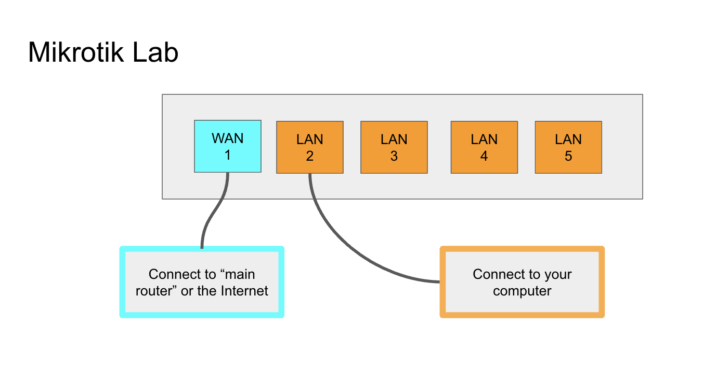
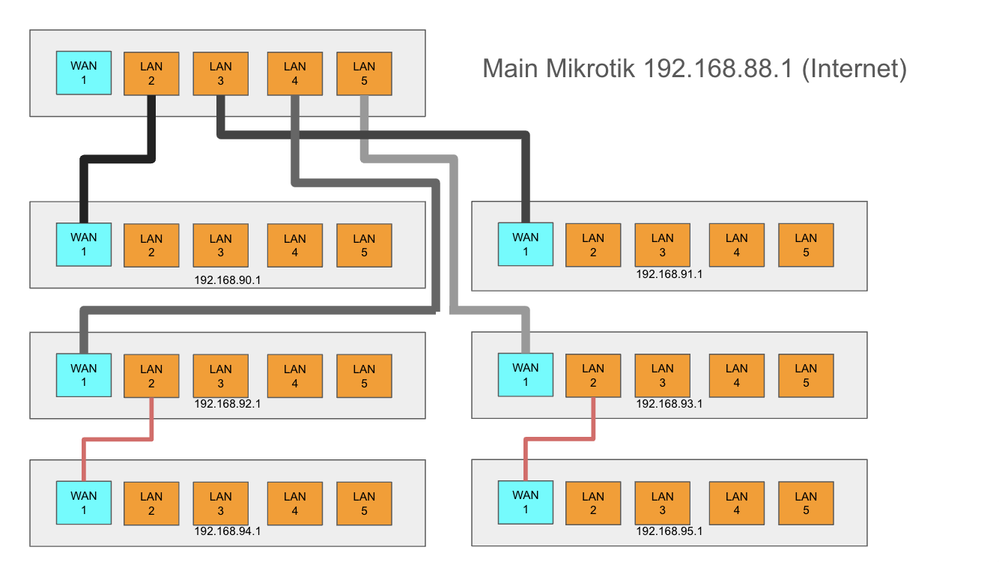

# ISOC Designing and Deploying Computer Networks LABS

## Lab 1 - Basic Networking 
#### Lecture: https://docs.google.com/presentation/d/1-A1YdEBYIDAOlrksCNzp31u37SOQqAPIBkinkNxtqNY/edit?usp=sharing
- Course Background
- Introductions
- History of Communications
- History of Computing
- ARPANET
- TCP/IP
- Packetization
- OSI Model
  
#### Hand on Lab
- Make an ethernet cable: https://www.wikihow.com/Create-an-Ethernet-Cable

## Lab 2 - Mikrotik Introduction
#### Lecture: https://docs.google.com/presentation/d/1nkGr8S5An02CQ5fo3RmMNeZxJ4dXIbm24C6_O8LXFJQ/edit?usp=sharing
- TCP vs UDP
- TCP 3-way handshake
- OSI Model
- Subnets
- DNS
- {Ports
- ICMP - Ping + Traceroute
- Firewalls
  
#### Hand on Lab

###### Set up Mikrotik : [Mikrotik-Lab.pdf](https://github.com/ereedsanchez/LABS-ISOC-Designing-and-Deploying-Computer-Networks/blob/4184522375c9b43be018cce71dd053a62cf25804/ISOC-DDCN-LAB2-Mikrotik-setup.pdf)
- If you are unable to download Winbox, you can also access MikrotikOS from 192.168.88.1
- Remember to connect your computr to the mikrotik in port 2, in the LAN section.ts 
- If you only have wifi, you can connect to your mikrotik, through the wifi SSID.  It will be the mikrotik and the last 6 digits of the MAC address of your wireless card. you can find this number on the sticker on the bottom of the Mikrotik router.

###### Let's make the internet
In the second part of this lab, we will emulate the making of the internet. Remember the internet is just a bunch of smallet networks connected. In the current configurations, your Mikrotik has no access to the internet or a WAN connection. You will connect your router to my router which does have internet, but you must properly configure your router or there will be conflicts!

1. Make 2 cables, one long cable to connect to my router that has internet, and one to connect the computer.
2. Login into the MikrotikOS, with Winbox, or 192.168.88.1
3. Go to Quickset.
4. Change your SSID names. make sure to have 2G and 5G at the end of your SSID names. Example: NextGenNet2G, NextGenNet5G.
5. Set an SSID password (optional)
6. Apply configurations.
7. Reconnect to your Mikrotik's SSID which you just changed.  (You got kicked off when you changed SSID names if you are connected via wifi)
8. Login again to MikrotikOs, and go to quickset.
9. Change the IP address to 192.168.xxx.1 - the xxx need to be changed to something that won't conflict with the Mikrotik you will connect to and give you internet. So it can't be 192.168.88.1.  Your professor will give you the correct ip to change to.
10. Change DHCP addresses to the same network as your IP address with a range from 10-254.  For example, if your IP is 192.168.90.1, your DHCP range will be 192.168.90.10-192.168.90.254.
11. Apply configurations.
12. Reconnect to MikrotikOS, if you are kickoff.  you will need to use the new IP address you just set to log in via the web browser. For example, if you change your IP address to 192.168.90.1, you will use that address to connect to the MikrotikOS.
13. Connect your WAN port to the Mikrotik that has internet.  If the main mikrotik router no longer has ports you can connect to your nieghbors Mikrotik router.
14. If you have internet, you can now claim you built a small portion of the internet by connecting your small lan network to a greater WAN network!  You are a winner!

## Lab 3 - Long Distance Wifi
#### Lecture: Wireless Networking https://docs.google.com/presentation/d/1rShq60_D9zChohIO1JIKpAD2wM9S0iUwqiGJKID3aSE/edit?usp=sharing
Radio Waves
History of Radio Technology 
Heinrich Hertz Radio Experiments
Hedy Lamar - frequency hopping 
Electricity - AC DC
Antenas and Electromagnetic Frequency
Wave Attributes
Wavelength
Bandwidth
Wifi Spectrum 2GHz, 5GHz
US FCC Frequency Allocation
Radio Wave Propagation 
Long Distance Wifi
Beacon Frames
Wireless Security 

#### Hand on Lab: Ubiquiti Nanobeam setup

Ubiquiti is an awesome company that makes wireless radios and antennas. They offer very affordable equipment and provide a platform for establishing long-distance WiFi connections. These radios are not meant to be used for WiFi connections to your phone or laptop, but instead for long-range connections from one building to another. In the front of the room, I have set up a Ubiquiti Litebeam as an access point. In today's lab, you will set up your Nanostation and connect it to the Litebeam access point.

1. Mounting the Nanostation:
   - Find a suitable location to mount your Nanostation, facing the direction of the Litebeam access point.
   - Use the included mounting hardware to securely attach the Nanostation to the chosen location.

2. Powering the device:
   - Connect the Nanostation to a power source using the provided PoE (Power over Ethernet) adapter.
   - Plug the PoE adapter into a power outlet.

3. Connecting the Ethernet cable:
   - From your POE adapter, connect the side that says POE to the Ethernet port on the Nanostation.
   - Connect the other port of the POE adapter to your computer's Ethernet port.

4. Change you IP in your computer
- Change the IP address on your computer to 192.168.1.100, Subnet 255.255.255.0, gateway 192.168.1.1, DNS 192.168.1.1
- Save your changes

4. Accessing the web interface:
   - Open a web browser on your computer and enter the default IP address of the Nanostation (192.168.1.20) into the address bar.
   - Log in using the default username (ubnt) and password (ubnt).

5. Configuring the device:
   - Once logged in, you'll be guided through the setup wizard.
   - Select the "Station" operating mode since you'll be connecting to the Litebeam access point.
   - In the wireless settings, click on the "Select" button next to the SSID field to discover available wireless networks.
   - Choose the SSID of the Litebeam access point from the list and enter the password if required.
   - Configure the network settings (IP address, subnet mask, etc.) as per your network requirements.

6. Aligning the antenna:
   - Adjust the Nanostation's antenna to point towards the Litebeam access point.
   - Use the built-in signal strength meter or the Ubiquiti AirOS "Antenna Alignment Tool" to fine-tune the antenna alignment for the best signal strength.

7. Updating the firmware (if necessary):
   - Check if there are any available firmware updates for your Nanostation model.
   - If an update is available, download and install it following the provided instructions.

8. Saving and applying settings:
   - Once you've completed the configuration and antenna alignment, click on the "Apply" button to save the changes.
   - The Nanostation will reboot with the new configuration.

9. Testing the connection:
   - After the reboot, check if your Nanostation has successfully connected to the Litebeam access point.
   - Open a web browser and try accessing the internet or the Litebeam's web interface to confirm the connection.

Remember to take note of any specific instructions or settings provided by your instructor for this lab. If you encounter any issues during the setup process, don't hesitate to ask your instructor for assistance.

## Lab 4 - Long Distance Wifi + Mikrotik

In the previous lab, we connected to the Nanostation via an Ethernet cable connected to our computer. However, there is actually an easier way to connect. These new Nanostations also have a configuration WiFi radio. This radio is only for configuring the device and will only be on for 15 minutes. This is for security reasons. Follow these steps and connect once again to the front-of-class AP, configuring your radio with the configuration WiFi.

##### From Ubiquiti:
1. Accessing airOS via Wi-Fi

- Verify connectivity in the airOS® Configuration Interface using the UISP™ app or Web Portal. Both are available for 15 minutes immediately after you power on the device. If necessary, you can power cycle the device to re-enable its Wi-Fi.

- You have the option to download the UISP App or 
Connect your device’s Wi-Fi to the SSID named: <model>:<MAC Address>

- You can find the mac address on the sticker placed on the Nanostation
Note: Ensure that DHCP is enabled on your Wi-Fi adapter.

2. Launch the app and follow the on-screen instructions.
- Web Portal: Connect your device’s Wi-Fi to the SSID named: <model>:<MAC Address>
- Note: Ensure that your Wi-Fi connection has DHCP enabled.

3. Launch your web browser and go to: http://setup.ui.com
- The airOS Configuration Interface will appear, allowing you to customize your settings as needed. For additional details, refer to the User Guide available at ui.com/download/airmax-ac

After this follow the instructions from the previous lab to connect to the Front of the room AP. 

#### Connect to Mikrotik
   1. Connect your ethernet cable from your POE adapter (that was previoulsy connected to your computer) to your Mikrotik router port 1 WAN.
   2. you should now have internet avaliable on your mikrotik router, and the Mikrotik wifi
  
The best way to think about this connection from your Nanostation is like an invisible cable connecting your MikroTik router to the Nanobeam AP, which is connected to the internet. The Nanostation should be set to bridge mode, and it will "bridge" the connection from your MikroTik to the internet. Also note that you will receive a WAN IP address on the MikroTik from the DHCP server on the "Main MikroTik," which is connected to the Nanobeam AP. Additionally, your Nanostation will also have an IP address assigned from the "Main MikroTik." 

## Lab 5 : Set up a NanoStation AP

